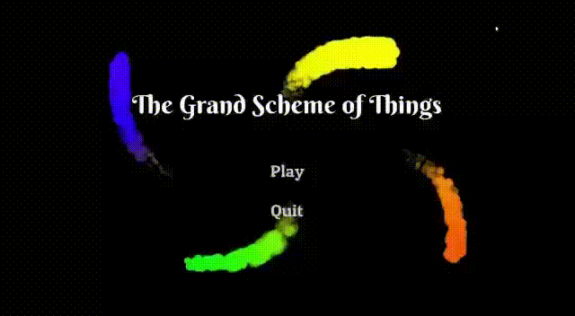

  
  

      Help Blåhaj make the arduous journey towards warmer waters..
  

  <a href='https://youtu.be/cYoHiLhbMKY'>Trailer</a>
  
  
  
  <h1> Gallery </h1>
  

      Pick between Blahaj the shark, or Genomblot the dolphin.
        
      Blahaj is agile and strong, whereas Genomblot is durable and clever.
  

  
    
  
    
  
  
  

      Fight various enemies, ranging from killer whales..
  

  
  

      ..to eels..
  

  
  

      ..to humans.
  

  
  
  

      Navigate through different depths of the ocean, dodging obstacles and slicing enemies.
  

  
  
  
  
  
  

  And for all to have a little fuzzy bath! and maintain his core body temperature All in a shark's day.
  

  
     
  
  
  
  
  <h1> Prerequisites </h1>
  <a href='https://godotengine.org/download/windows'> Godot game engine ver3.2.1 </a>
  
  
  
  <h1> Getting Started </h1>
  

      1. Start up the engine (run the exe file, which in my case is Godot_v3.2.1-stable_win64.exe)
  

  

      2. Select the 'Import' option 
  

  
    
  

      3. Browse to where the project has been downloaded
  

    
  

      4. Select the 'project.godot' file, and open it
  

  
    
  

      5. Press the 'Play' button in the top right
  

  
    
  

      Enjoy! <a style="display: inline" href='https://docs.godotengine.org/en/stable/index.html'>Operating through Godot</a> is a breeze.
  

  
  
  
  <h1> Deployment </h1>
  

      1. Start up the engine. Make sure to pick the correct project.godot file.
       
      2. In the top-left, under the 'Project' section, select subsection 'Export..'. 
  

  

  

      3. A window will open. Pick the correct deployment environment (Windows desktop, in this case).
  

  
    
  

      4. Browse to where you want to deploy the game
  

  
    
  

      5. Make sure you want to set your desired options here (for example, you may set the deployed application icon here).
       
      6. Deploy it.
  

  
   
   
   
  <h1> Built with </h1>
  <ul>
      <li>
        Godot Engine ver3.2.1
      </li>
      <li>
      Aseprite ver1.1.6
      </li>
  </ul>
   
   
   
  <h1> Co-authors </h1>
  

      <a href='https://github.com/Rain1213'> Rain1213 </a>
       
      <a href='https://github.com/edgeemperor'> edgeemperor </a>
       
      <a href='https://github.com/d35r0n'> d35r0n </a>
  

   
   
   
  <h1> Acknowledgments </h1>
  

      <a href='https://www.ikea.com/us/en/p/blahaj-soft-toy-shark-90373590/'> Blahaj the plushie! </a>
  

